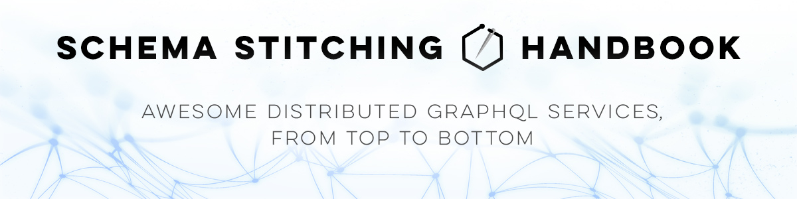

# 

Guided examples of [Schema Stitching](https://www.graphql-tools.com/docs/stitch-combining-schemas) doing awesome things. Focuses on the new (GraphQL Tools v6+) stitching using [type merging](https://www.graphql-tools.com/docs/stitch-type-merging), not legacy [Apollo Stitching](https://www.apollographql.com/docs/federation/migrating-from-stitching/).

## Table of Contents

- **[Chapter 1 - Combining local and remote schemas](./combining-local-and-remote-schemas)**

  - Adding a locally-executable schema.
  - Adding a remote schema, fetched via introspection.
  - Adding a remote schema, fetched from a custom SDL service.
  - Avoiding schema conflicts using transforms.
  - Basic error handling.

- **[Chapter 2 - Mutations &amp; Subscriptions](./mutations-and-subscriptions)**

  - Adding a remote mutation service.
  - Adding a remote subscription service.
  - Adding a subscriber proxy.

- **[Chapter 3 - Single-record type merging](./type-merging-single-records)**

  - One-way type merge using single-record queries.
  - Multi-directional type merge using single-record queries.
  - Query/execution batching.

- **[Chapter 4 - Array-batched type merging](./type-merging-arrays)**

  - One-way type merge using array queries.
  - Multi-directional type merge using array queries.
  - Handling array errors.
  - Nullability & error remapping.

- **[Chapter 5 - Cross-service interfaces](./type-merging-interfaces)**

  - Distributing a GraphQL interface across services.

- **Chapter 6 - Nullable merges**

  - tktk

- **Chapter 7 - Computed fields**

  - tktk

- **[Chapter 8 - Federation services](./federation-services)**

  - Integrating Apollo Federation services into a stitched schema.
  - Fetching and parsing Federation SDLs.

- **[Chapter 9 - Stitching directives SDL](./stitching-directives-sdl)**

  - Use of the `@key`, `@merge`, and `@computed` directives to specify type merging configuration.

- **[Chapter 10 - Hot schema reloading](./hot-schema-reloading)**

  - Hot reload of the combined gateway schema (no server restart).
  - Polling for remote subschema changes.
  - Mutations for adding/removing remote subservices.
  - Handling subservice request timeouts.

- **[Chapter 11 - Versioning schema releases](./versioning-schema-releases)**

  - Using GitHub API to manage a simple schema registry.
  - Hot reloading from a remote Git registry.
  - Running development and production environments.

- **Chapter 12 - Continuous Integration (CI) testing**

  - tktk

- **Appendices**

  - [What is Array Batching?](https://github.com/gmac/schema-stitching-demos/wiki/Batching-Arrays-and-Queries#what-is-array-batching)
  - [What is Query Batching?](https://github.com/gmac/schema-stitching-demos/wiki/Batching-Arrays-and-Queries#what-is-query-batching)
